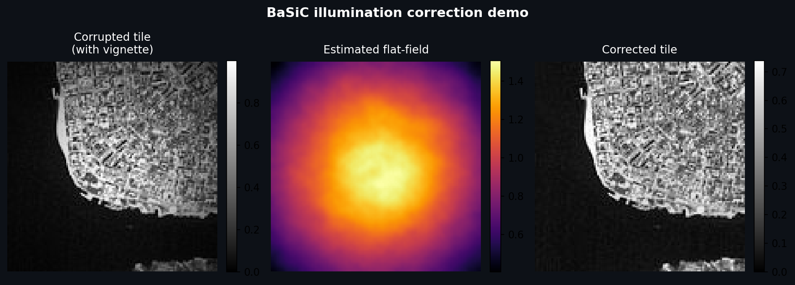
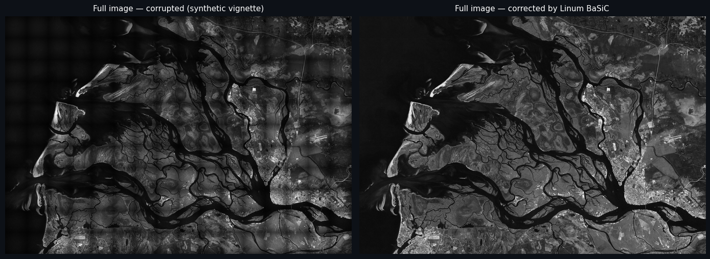
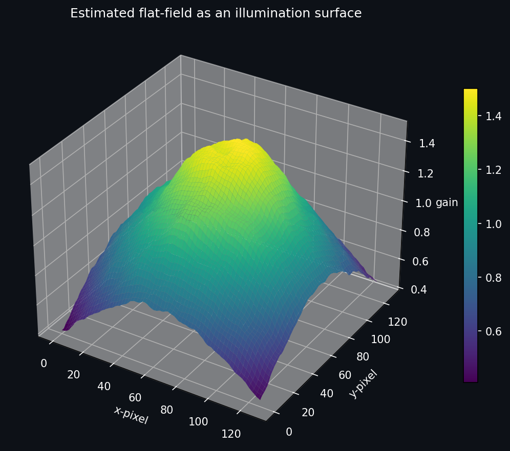

Linum BaSiC
===========

**Linum BaSiC** is a Python implementation of the BaSiC (Background and
Shading Correction) algorithm for optical microscopy images.  It
corrects spatially non-uniform illumination (flatfield) and background
offsets (darkfield) from fluorescence, bright-field, and other modalities.

----

   **Left:** a sample tile with a synthetic Gaussian vignette (dark corners, bright
   centre). **Centre:** the flat-field estimated by linum-basic from 176 such tiles — no
   ground truth required. **Right:** the same tile after BaSiC correction.

   Full 1442 x 2048 image before (left) and after (right) linum-basic correction.  Each
   tile's vignette — dark corners caused by non-uniform illumination — is removed
   uniformly across the entire field of view.

   The estimated flat-field rendered as an illumination surface.  The smooth dome
   captures the microscope's spatially varying gain — bright at the centre, falling
   off towards the edges — which BaSiC divides out of every tile.

.. code-block:: python

   from linum_basic import BaSiC

   model = BaSiC(stack, estimate_darkfield=True)
   model.prepare()   # load images and auto-tune regularisation
   model.run()       # fit flat-field and dark-field
   corrected = [model.normalize(tile) for tile in stack]

----

.. grid:: 1 2 2 2
   :gutter: 3

   .. grid-item-card:: Getting Started
      :link: getting_started
      :link-type: doc

      Installation, minimal working example, and CLI quick-reference.

   .. grid-item-card:: Algorithm
      :link: algorithm
      :link-type: doc

      Mathematical derivation of the BaSiC model, the ALM solver, and
      the reweighting scheme with flow diagrams.

   .. grid-item-card:: Parameter Tuning
      :link: parameters
      :link-type: doc

      Detailed guide for every tuning knob — physical meaning, default
      heuristics, and troubleshooting recipes.

   .. grid-item-card:: Library API
      :link: api/index
      :link-type: doc

      Auto-generated reference for the ``linum_basic`` Python package.

   .. grid-item-card:: GPU Acceleration
      :link: gpu
      :link-type: doc

      Run BaSiC on CUDA hardware using the PyTorch backend (Apple MPS unsupported).

   .. grid-item-card:: Contributing
      :link: contributing
      :link-type: doc

      Dev environment, pre-commit, make targets, and docstring conventions.

   .. grid-item-card:: Example Notebooks
      :link: notebooks/index
      :link-type: doc

      Worked examples: load data, synthesise shading, run BaSiC, evaluate results.

.. toctree::
   :maxdepth: 1
   :hidden:

   getting_started
   algorithm
   parameters
   gpu
   validation
   contributing
   notebooks/index
   reference
   api/index

Indices and tables
==================

* :ref:`genindex`
* :ref:`modindex`
* :ref:`search`
